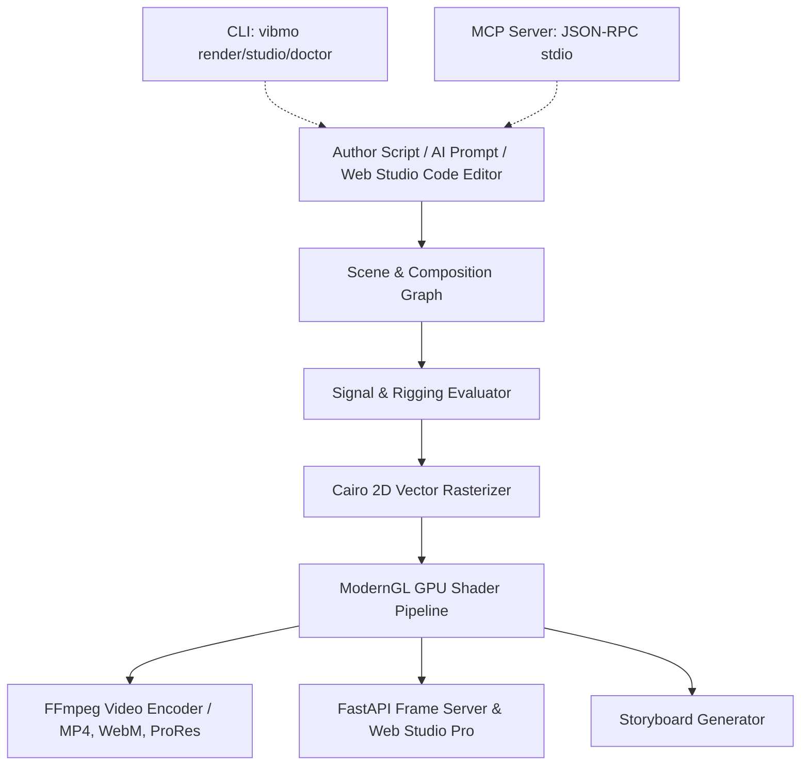

# ✦ Vibmo: Engine Architecture & Runtime Layers

This document outlines the end-to-end architectural layers of the **Vibmo** motion graphics system, explaining how high-level authoring scripts flow down to the hardware rendering pipelines, interactive studio, and AI agent interfaces.

---

## 🏛️ System Architecture Overview

---

## 층 The 6 Runtime Layers

### 1. Authoring Layer (`vibmo.agent_api`, `vibmo.scene`, `vibmo.composition`)
- **Single-Line God Import**: `from vibmo.agent_api import *` exposes the unified public API.
- **Declarative Scene Graph**: Composed of `Scene`, `Composition`, `Shot`, and semantic nodes (`GlassCard`, `KineticText`, `MetricCounter`, `BrowserWindow`, `Icon`, etc.).
- **Choreography Generators**: Python generators decorated with `@scene.animate` orchestrate actions sequentially or in parallel using `yield scene.all(...)`, `yield node.pop_in()`, or `yield scene.wait(t)`.

### 2. Signal & Rigging Evaluation Layer (`vibmo.core.signal`, `vibmo.rigging`)
- **Reactive Signals**: Node properties (position, scale, rotation, opacity, color) are reactive `Signal` instances.
- **Physics & Easing**: Evaluates spring mechanics (`Spring`), cubic Bézier curves (`Ease`), and motion paths at timestamp $t$.
- **Constraints & Expressions**: `LookAtConstraint`, `FollowConstraint`, and `ExpressionSignal` dynamically compute transforms per frame prior to rendering.

### 3. Vector Rasterization Engine (`vibmo.render.rasterizer`)
- **PyCairo 2D Pipeline**: Stateless, deterministic frame rendering.
- **Hierarchical Transform Stacks**: Handles 2D affine transforms, 2.5D perspective tilts (`Matrix3D`), and clipping paths.
- **Advanced Compositing**: Evaluates 17 layer blend modes (Multiply, Screen, Overlay, Add) and Gaussian-feathered soft masks.

### 4. GPU Post-Processing & Shaders (`vibmo.render.gpu`, `vibmo.fx`)
- **ModernGL Shaders**: Fast multi-pass fragment shader pipeline.
- **Cinematic Effects**: Vignette, film grain, bloom, depth-of-field blur, chromatic aberration, and ACES filmic color management / tone mapping.
- **Graceful Software Fallback**: Transparently falls back to CPU-accelerated PIL/SciPy filters when a hardware OpenGL context is unavailable.

### 5. Delivery & Ingestion Layer (`vibmo.render.ffmpeg`, `vibmo.audio`)
- **Streaming FFmpeg Pipe**: Streams raw RGBA frame buffers into an asynchronous FFmpeg subprocess without intermediate disk writes.
- **Fast-Start Web Streaming**: Automatically injects `-movflags +faststart` to place the `moov` atom at the beginning of MP4 files.
- **Audio Stem Mixer**: Multi-track audio mixing and stem exports (`stem_music.wav`, `stem_vo.wav`, `stem_sfx.wav`, `stem_master.wav`).

### 6. Client Entry Points (`vibmo.cli`, `vibmo.studio`, `vibmo.mcp`)
- **CLI (`vibmo`)**: Commands for `init`, `render`, `storyboard`, `studio`, `doctor`, `schema`, and `mcp`.
- **Web Studio Pro (`vibmo.studio`)**: In-browser DaVinci Resolve-inspired workstation featuring Motion (NLE), Fusion (Node Graph), Color, Fairlight, and Deliver workspaces with an In-Studio Python IDE (`Ctrl+E`).
- **Model Context Protocol Server (`vibmo.mcp`)**: JSON-RPC 2.0 stdio server enabling Claude Desktop, Cursor, Antigravity, and AI agents to validate scenes, generate animations, and render videos autonomously.

---

## 🔄 Lifecycle of a Render Call

1. **`scene.render("output.mp4")`**
2. **Timeline Pre-flight**: Traverses generator functions and compiles absolute keyframe spans.
3. **Audio Synthesis**: Renders and mixes multi-track procedural SFX and audio clips.
4. **Pipeline Frame Streaming**: Parallel / sequential workers evaluate frame $t = i / \text{fps}$, rasterize vector layers to RGBA buffers, apply GPU post-shaders, and write raw bytes into FFmpeg stdin.
5. **Final Muxing**: Audio stems and video streams are muxed into the output container with web streaming optimization.
